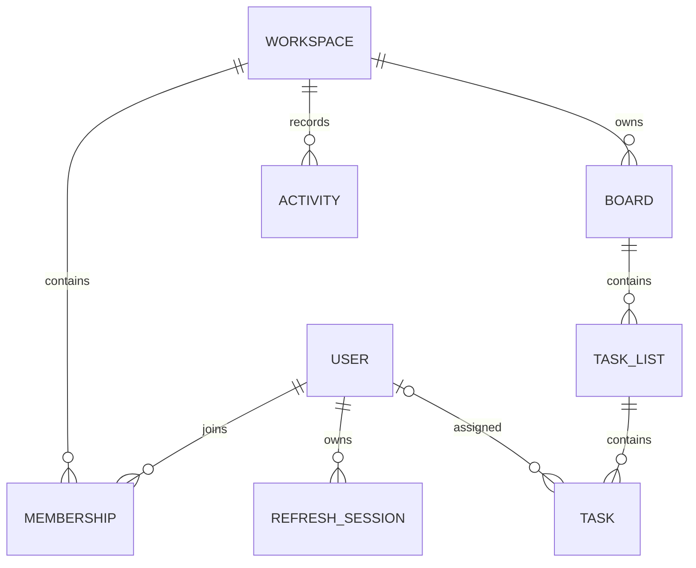

# Commonplace

A real-time collaborative workspace for teams, with a Next.js client and an Express, Prisma, PostgreSQL, Redis, and Socket.IO API.

## Local setup

Requirements: Docker Desktop and Node.js 20+.

```sh
cp .env.example .env
docker compose up --build
```

Open `http://localhost:3000` and create an account. Signup creates a workspace, an Owner membership, a board, and its initial ordered lists. The API is available at `http://localhost:4000`; `GET /health` is the health check.

To seed repeatable evaluation accounts and sample board tasks, set `DEMO_ACCOUNT_PASSWORD` in `.env` to a value of at least 12 characters and run `docker compose exec api npm run db:seed`. This creates `owner.demo@example.com` as Owner and `member.demo@example.com` as Member in the same `Commonplace Demo` workspace. Use the value you set as both passwords. Demo accounts are for local evaluation only; do not enable them on a public production deployment.

For development without Compose, install dependencies in the project root and `api/`, copy `.env.example` to `.env`, export its values with `set -a; source .env; set +a`, then run the API's `npm run db:migrate`, `npm run dev`, and the web app's `npm run dev` in separate terminals.

## Architecture and security



Every membership is keyed by `(workspaceId, userId)`. Boards, lists, and tasks carry the workspace ID, and child-to-parent relations use composite keys so a child cannot point at a parent in another tenant. API lookups are additionally scoped to the authenticated workspace membership. The Prisma schema is at `api/prisma/schema.prisma`; the initial versioned migration is in `api/prisma/migrations/`.

Roles are `OWNER`, `ADMIN`, `MEMBER`, and `VIEWER`. A centralized policy controls reads, writes, and member administration on the server. Board sockets authenticate the access token and authorize membership before joining workspace-and-board-specific rooms.

Access JWTs expire after 15 minutes. Refresh tokens are random, stored only in an `httpOnly` cookie (`SameSite=Lax` locally and `SameSite=None; Secure` in production for cross-origin Vercel/Render requests), and persisted as SHA-256 hashes. Rotation revokes the prior session atomically; reuse of a revoked token revokes the user's active sessions. Access tokens remain in browser memory rather than local storage.

Task/list positions use lexicographically sortable fractional ranks. A mutation is version-checked and committed with its activity row in PostgreSQL before broadcasting. Stale edits or ordering collisions return `409`; clients can reload and retry. Redis caches workspace counts for 30 seconds and invalidates after task/member changes; cache failures fall back to PostgreSQL. BullMQ sends invitation email asynchronously when `SMTP_URL` is configured; otherwise the invitation link remains available to copy in the UI.

Search is paginated and supports title/description text plus assignee, label, and status filters. Activity is paginated by cursor. Validation uses Zod and API errors do not expose stack traces.

## Commands

```sh
npm run dev                 # web client, port 3000
npm run build
npm run lint
(cd api && npm run dev)       # API + Socket.IO, port 4000
(cd api && npm run build)
(cd api && npm test)
(cd api && RUN_INTEGRATION_TESTS=true npm test) # after exporting .env values
(cd api && npm run db:migrate)
```

## Current limitations

The implementation covers account signup/login/refresh/logout, invited signup, member/role management, workspace discovery, board reads, task create/edit/move/delete, search, activity, summary caching, and live task broadcasts. All six API integration tests pass against local Docker Postgres/Redis. Hosted Vercel/Render deployment still requires owner-controlled hosting accounts, domain configuration, and SMTP credentials.
